```mermaid
sequenceDiagram
    participant User as Usuario
    participant Application as Front-end
    participant Server as Back-end

    User->>Application: 1. Inicia o processo de login
    Application->>Server: 2. Envia solicitação de login (POST /auth/login)
    Server->>Server: 3. Verifica as credenciais no banco de dados
    Server-->>Application: 4. Confirmação de sucesso (HTTP 200)
    Server-->>Application: 5. Gera um token JWT
    Application-->>User: 6. Logado com sucesso

```

<h1 align=center>to-day-list</h1>
<div align=center>
	
</div>

<h1>Índice 📚</h1>
<ol>
    <li><a href="#front-end">Front-end 💻</a></li>
    <ul>
        <li><a href="#tela-de-registro">Tela de Registro ✏️</a></li>
        <li><a href="#tela-de-login">Tela de Login 🔒</a></li>
        <li><a href="#tela-principal">Tela Principal 🪟</a></li>
    </ul>
    <li><a href="#back-end">Back-end ⚙️</a></li>
    <ul>
        <li><a href="#api-rest">API Rest 🌐</a></li>
        <li><a href="#registrar">Registrar ✏️</a></li>
        <li><a href="#login">Login 🔒</a></li>
    </ul>
    <li><a href="#bcrypt">BCrypt 🔏</a></li>
    <li><a href="#criacao-de-tasks">Criação de Tasks ☑️</a></li>
    <li><a href="#diagrama-de-classes">Diagrama de Classes 📝</a></li>
    <li><a href="#chat-assistente">Chat Assistente 💬</a></li>
    <li><a href="#principais-bibliotecas">Principais Bibliotecas 📚</a></li>
    <li><a href="#tech-stack-utilizada">Tech Stack Utilizada 🛠️</a></li>
</ol>

<h1 id="front-end">Front-end 💻</h1>

<h2 id="tela-de-registro">Tela de Registro ✏️</h2>
<p>Tela de registro aonde é necessario seu nome, e-mail e uma senha de 8 caracteres</p>
<div align=center>
	
</div>

<h2 id="tela-de-login">Tela de Login 🔒</h2>
<p>Tela aonde deve ser passada as informações de login previamente cadastradas</p>
<div align=center>
	
</div>

<h2 id="tela-principal">Tela Principal 🪟</h2>
<p>Tela principal com a criação, listagem, atualização e exclusão das tasks, e na barra da direita um ChatBot usando com tecnologia do ChatGPT 3.5</p>
<div align=center>
	
</div>

<h1 id="back-end">Back-end ⚙️</h1>

<h2 id="api-rest">API Rest 🌐</h2>

<table align=center>
    <thead>
        <tr>
            <th>Endpoint</th>
            <th>Método</th>
            <th>Body</th>
            <th>Status</th>
            <th>Response</th>
            <th>Descrição</th>
        </tr>
    </thead>
    <tbody align=center>
        <tr>
            <td>/auth/register</td>
            <td>POST</td>
            <td>UserRegister</td>
            <td>201</td>
            <td></td>
            <td>Cadastrar o usuário.</td>
        </tr>
        <tr>
            <td>/auth/login</td>
            <td>POST</td>
            <td>UserLogin</td>
            <td>200</td>
            <td>Token</td>
            <td>Logar o usuário e gerar um Token.</td>
        </tr>
        <tr>
            <td>/tasks/create</td>
            <td>POST</td>
            <td>TaskRequestData</td>
            <td>201</td>
            <td></td>
            <td>Cria uma nova Task.</td>
        </tr>
        <tr>
            <td>/tasks/list/{login}</td>
            <td>GET</td>
            <td></td>
            <td>200</td>
            <td>TaskResponseData[]</td>
            <td>Lista de todas as tasks.</td>
        </tr>
	<tr>
            <td>/tasks</td>
            <td>PUT</td>
            <td>TaskUpdateData</td>
            <td>200</td>
            <td>TaskResponseData</td>
            <td>Atualiza uma Task existente.</td>
        </tr>
        <tr>
            <td>/tasks/{taskId}</td>
            <td>DELETE</td>
            <td></td>
            <td>204</td>
            <td></td>
            <td>Deleta a Task escolhida.</td>
        </tr>
	<tr>
            <td>/chat</td>
            <td>POST</td>
            <td>ChatRequestData</td>
            <td>200</td>
            <td>String</td>
            <td>Responde a pergunta solicitada.</td>
        </tr>
    </tbody>
</table>

<h2 id="registrar">Registrar ✏️</h2>

<p> É necessario passar o email e senha fornecidos durante o registro, caso seja valido, sera devolvido um Token JWT para autenticação.</p>

<h3>Dados necessarios:</h3>

<ul class=list>
    <li>➡️ seu nome </li>
    <li>➡️ seu login (email) </li>
    <li>➡️ sua senha </li>
</ul>

<h3>Exemplo de request body: </h3>

```json
{
    "username": "luiz",
    "login": "luiz@gmail.com",
    "password": "123456"
}
```

<h3>Exemplo de responsy body: </h3>

```json
{
    "id": 1,
    "username": "luiz",
    "login": "luiz@gmail.com",
    "password": "$2a$10$diT5bwmH91kdVQvNmmUAae.e8sIUgfkixdgfAJqWr17R.jjldSAsK",
    "enabled": true,
    "authorities": [
        {
            "authority": "Usuario"
        }
    ],
    "accountNonLocked": true,
    "accountNonExpired": true,
    "credentialsNonExpired": true
}
```

<h2 id="bcrypt">BCrypt 🔏</h2>

<p> Foi usado a criptografia do algoritimo HMAC256 para criptografar as senhas dos usuários e armazenalas no banco de dados da maneira correta seguindo os padrões estabelecidos pela <a href="https://www.planalto.gov.br/ccivil_03/_ato2015-2018/2018/lei/l13709.htm" target="_blank">LGPD</a>. </p>

<div>
    
</div>

<h2 id="login">Login 🔒</h2>

<p> É necessario passar o email e senha fornecidos durante o registro, caso seja valido, sera devolvido um Token JWT para autenticação.</p>

<h3>Dados necessarios:</h3>

<ul class=list>
    <li>➡️ seu login (email)</li>
    <li>➡️ sua senha</li>
</ul>

<h3>Exemplo de request body:</h3>

```json
{
    "login": "seuemail@gmail.com",
    "password": "12345678"
}
```

<h3>Token JWT :key: </h3>
<p>Exemplo de Token JWT gerado caso a requisição de login seja bem sucedida, nele possui os dados relacionados ao usuario que o gerou e tem validade de 2 horas.</p>

<h3>Exemplo de response body:</h3>

```json
{
    "token": "eyJ0eXAiOiJKV1QiLCJhbGciOiJIUzI1NiJ9. TyJzdWIiOiJlZG5hbGRvLmVsbjY4QGdtYWlsLmNvbSIsImlzcyI6IlRvLWRvIGxpc3QiLCJleHAiOjE2OegwODY1MTB9.gFolC6lmSqS9FiAdM1zIX0CftVAokc495pkMNnDYLaU"
}
```

<h3>Diagrama de sequencia 📝</h3>
<p>Esse diagrama ilustra o processo da requisição do usuário, aonde ela é enviada do Front-end até o servidor, aonde ela sera processada e se validada, retorna um Token JWT que será armazenado no localstorage do navegador.</p>



<hr>

<h2 id="criacao-de-tasks">Criação de Tasks ☑️</h2>

<h3>Dados necessarios:</h3>

<ul class=list>
    <li>➡️ titulo da tarefa </li>
    <li>➡️ descrição da tarefa (opcional) </li>
    <li>➡️ prioridade (BAIXA, MEDIA, ALTA) </li>
    <li>➡️ data inicio da tarefa </li>
    <li>➡️ data prevista para finalizar </li>
    <li>➡️ email do usuario </li> <br>
</ul>

> ⚠️ OBS: no Front-end o email não é necessario, visto que ele  é atribuido automaticamente atraves da decodificação do token JWT enviado

<h4>Exemplo:</h4>

```json
{
    "title": "Estudar",
    "description": "estudar orientação a objetos com Java",
    "priority": "ALTA",
    "startAt": "2023-11-06T12:30:00",
    "endAt": "2023-11-08T12:30:30",
    "userLogin": "ednaldo.eln68@gmail.com"
}
```

<h2 id="diagrama-de-classes">Diagrama de Classes 📝</h2>
<p>Diagrama ilustrativo do modelo orientado a objetos dando uma breve visão de como o sistema e as entidades do banco de dados estão ligadas usando um SGBD relacional</p>


<h2 id="chat-assistente">Chat Assistente 💬</h2>

<p> Caso envie uma mensagem, ela será validade pela Api do GPT 3.5, caso ele encontre uma solução, irá enviar uma resposta. </p>

<h3>Dados necessarios:</h3>

<ul class=list>
    <li>➡️ pergunta/descrição da Task </li>
</ul>

<h3>Exemplo de request body:</h3>

```json
{
    "prompt": "olá, bom dia!"
}
```

<h3>Exemplo de response body: </h3>

```json
{
    "role": "assistant",
    "content": "Olá! Bom dia! Como posso ajudar?"
}
```

<h2 id="principais-bibliotecas">Principais Bibliotecas 📚</h2>

<h3>OpenAI GPT 3.5 </h3>
<p>biblioteca usada para realizar conexão com a API do ChatGPT</p>

```xml
<dependency>
	<groupId>com.theokanning.openai-gpt3-java</groupId>
	<artifactId>service</artifactId>
	<version>0.16.0</version>
</dependency>
```

<h3>Spring Security </h3>
<p>biblioteca usada para filtrar as requisições e autenticar os usuários</p>

```xml
<dependency>
	<groupId>org.springframework.boot</groupId>
	<artifactId>spring-boot-starter-security</artifactId>
</dependency>
```

<h3>Auth0 JWT </h3>
<p>biblioteca usada para gerar o Token JWT</p>

```xml
<dependency>
	<groupId>com.auth0</groupId>
	<artifactId>java-jwt</artifactId>
	<version>4.2.1</version>
</dependency>
```

<h3>Docker Compose </h3>
<p>biblioteca usada em conjunto com o docker-compose.yml para criação do container com a imagem do MySQL</p>

```xml
<dependency>
	<groupId>org.springframework.boot</groupId>
	<artifactId>spring-boot-docker-compose</artifactId>
	<version>3.1.0</version>
</dependency>
```

<h2 id="tech-stack-utilizada">Tech Stack Utilizada 🛠️</h2>

<table align="center" width=1000px>
    <thead>
        <tr>
            <th></th>
            <th></th>
            <th></th>
            <th></th>
            <th></th>
            <th></th>
	    <th></th>
	    <th></th>
        </tr>
    </thead>
    <tbody align="center">
        <tr>
            <td>MySQL</td>
            <td>Hibernate</td>
            <td>Spring Boot</td>
            <td>Java</td>
            <td>Javascript</td>
            <td>VSCode</td>
	    <td>Postman</td>
	    <td>Docker</td>
        </tr>
        <tr>
            <td>🔖 8.1.0</td>
            <td>🔖 6.3</td>
            <td>🔖 3.1.4</td>
            <td>🔖 17</td>
            <td>🔖 ES6</td>
            <td>🔖 1.83</td>
	    <td>🔖 10.19</td>
	    <td>🔖 24.0.6</td>
        </tr>
    </tbody>
</table>
